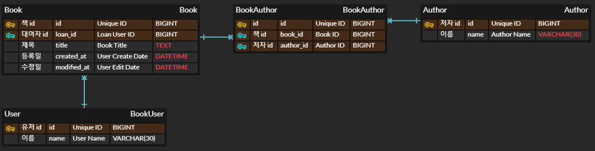

# 도서-JPA

---

## Lv 0. API 명세 및 ERD 작성

### Requirement

- [X] API 명세서 작성
- [X] ERD 작성
- [X] SQL 작성

#### Definition

- [X] API 명세서 작성
    - [X] 도서 API 설계
        - [X] 도서 생성(등록)
        - [X] 전체 도서 조회
        - [X] 단건 도서 조회
        - [X] 도서 수정
        - [X] 도서 삭제

    - [X] 저자 API 설계
        - [X] 저자 생성(등록)
        - [X] 저자가 집필한 도서 목록 조회
        - [X] 저자 수정
        - [X] 저자 삭제

    - [X] 이용자 API 설계
        - [X] 이용자 생성(등록)
        - [X] 이용자 대출
        - [X] 이용자 반납
        - [X] 이용자가 대출한 목록 조회

- [X] ERD 작성
    - [X] book
        - [X] id : 책 아이디 / BIGINT / (PK)
        - [X] title : 할일 제목 / TEXT
        - [X] authors : 저자 목록
        - [X] loan_id : 대출 한 이용자 아이디 / BIGINT / (FK)
        - [X] created_at : 작성일 / DATETIME
        - [X] modified_at : 수정일 / DATETIME

    - [X] author
        - [X] id : 저자 아이디 / BIGINT / (PK)
        - [X] name : 저자 이름 / VARCHAR(30)
        - [X] books : 해당 저자의 책 목록 /

    - [X] bookauthor
        - [X] id : 책 정보 아이디 / BIGINT / (PK)
        - [X] book_id : 책 아이디 / BIGINT / (FK)
        - [X] author_id : 저자 아이디 / BIGINT / (FK)

    - [X] user
        - [X] id : 이용자 아이디 / BIGINT / (PK)
        - [X] name : 이용자 이름 / VARCHAR(30)

- [X] SQL 작성

#### API 명세서

**book**

|      기능      | HTTP Method |      URL      | Parameters                  | Request Body                                      | Response                                                                                                                           | HTTP Status   |
|:------------:|-------------|:-------------:|-----------------------------|---------------------------------------------------|:-----------------------------------------------------------------------------------------------------------------------------------|---------------|
|   책 생성(등록)   | **POST**    |   `/books`    | NONE                        | { "title" : string, "authors" : List<Integer> }   | { "id" : long, "title" : string, "authors" : List<Author>, "loanId" : long, "createdAt" : string, "modifiedAt" : string }          | `201 CREATED` |
| 전체 책 조회(페이징) | **GET**     |   `/books`    | Query : pageNumber&pageSize | NONE                                              | Page 형태 { "id" : long, "title" : string, "authors" : List<Author>, "loan_id" : long, "createdAt" : string, "modifiedAt" : string } | `200 OK`      |
|   단건 책 조회    | **GET**     | `/books/{id}` | Path : id                   | NONE                                              | { "id" : long, "title" : string, "authors" : List<Author>, "loanId" : long, "createdAt" : string, "modifiedAt" : string }          | `200 OK`      |
|     책 수정     | **PUT**     | `/books/{id}` | Path : id                   | { "title" : string, "author_id" : List<Integer> } | { "id" : long, "title" : string, "authors" : List<Author>, "loanId" : long, "createdAt" : string, "modifiedAt" : string }          | `200 OK`      |
|     책 삭제     | **DELETE**  | `/books/{id}` | Path : id                   | NONE                                              | NONE                                                                                                                               | `200 OK`      |

**author**

|        기능        | HTTP Method |       URL       | Parameters | Request Body                                 | Response                                                       | HTTP Status   |
|:----------------:|-------------|:---------------:|------------|----------------------------------------------|:---------------------------------------------------------------|---------------|
|    저자 생성(등록)     | **POST**    |   `/authors`    | NONE       | { "name" : string }                          | { "id" : long, "name" : string, "books" : List<Book> }         | `201 CREATED` |
|     전체 저자 조회     | **GET**     |   `/authors`    | NONE       | NONE                                         | Page 형태 { "id" : long, "name" : string, "books" : List<Book> } | `200 OK`      |
| 저자가 집필한 도서 목록 조회 | **GET**     | `/authors/{id}` | Path : id  | NONE                                         | { "id" : long, "name" : string, "books" : List<Book> }         | `200 OK`      |
|      저자 수정       | **PUT**     | `/authors/{id}` | Path : id  | { "name" : string, "books" : List<Integer> } | { "id" : long, "name" : string, "books" : List<Book> }         | `200 OK`      |
|      저자 삭제       | **DELETE**  | `/authors/{id}` | Path : id  | NONE                                         | NONE                                                           | `200 OK`      |

**user**

|        기능         | HTTP Method |         URL          | Parameters | Request Body        | Response                                                  | HTTP Status   |
|:-----------------:|-------------|:--------------------:|------------|---------------------|:----------------------------------------------------------|---------------|
|    이용자 생성(등록)     | **POST**    |       `/users`       | NONE       | { "name" : string } | { "id" : long, "name" : string, "loanList" : List<Book> } | `201 CREATED` |
|     이용자 도서 대출     | **POST**    |  `/users/loan/{id}`  | Path : id  | { "name" : string } | { "id" : long, "name" : string, "loanList" : List<Book> } | `200 OK`      |
|     이용자 도서 반납     | **POST**    | `/users/return/{id}` | Path : id  | { "name" : string } | { "id" : long, "name" : string, "loanList" : List<Book> } | `200 OK`      |
| 이용자가 대출한 도서 목록 조회 | **GET**     |    `/users/{id}`     | Path : id  | NONE                | { "id" : long, "name" : string, "loanList" : List<Book> } | `200 OK`      |

#### ERD 작성



#### SQL 작성

```mysql
CREATE TABLE author
(
    id   BIGINT AUTO_INCREMENT PRIMARY KEY,
    name VARCHAR(30) NOT NULL
);

CREATE TABLE user
(
    id   BIGINT AUTO_INCREMENT PRIMARY KEY,
    name VARCHAR(30) NOT NULL
);

CREATE TABLE book
(
    id          BIGINT AUTO_INCREMENT PRIMARY KEY,
    title       TEXT     NOT NULL,
    loan_id     BIGINT,
    created_at  DATETIME NOT NULL,
    modified_at DATETIME NOT NULL,
    CONSTRAINT fk_user FOREIGN KEY (loan_id) REFERENCES user (id)
);

CREATE TABLE book_author
(
    id        BIGINT AUTO_INCREMENT PRIMARY KEY,
    book_id   BIGINT NOT NULL,
    author_id BIGINT NOT NULL,
    CONSTRAINT fk_book FOREIGN KEY (book_id) REFERENCES book (id) ON DELETE CASCADE,
    CONSTRAINT fk_author FOREIGN KEY (author_id) REFERENCES author (id) ON DELETE CASCADE,
    UNIQUE (book_id, author_id)
);
```

---

### Configuration

#### Common
- [X] TimeStamped Entity
- [X] Exception

#### Author

- [X] Author Entity
- [X] Author Request
- [X] Author Response
- [ ] Author Controller
    - [ ] 등록
    - [ ] 전체 조회
    - [ ] 해당 저자 책 조회
    - [ ] 수정
    - [ ] 삭제
- [ ] Author Service
    - [ ] 등록
    - [ ] 전체 조회
    - [ ] 해당 저자 책 조회
    - [ ] 수정
    - [ ] 삭제
- [ ] Author Repository

#### Book

- [X] Book Entity (TimeStamped Auditing)
- [X] Book Request
- [X] Book Response
- [ ] Book Controller
    - [ ] 등록
    - [ ] 전체 조회
    - [ ] 단건 조회
    - [ ] 수정
    - [ ] 삭제
- [ ] Book Service
    - [ ] 등록
    - [ ] 전체 조회
    - [ ] 단건 조회
    - [ ] 수정
    - [ ] 삭제
- [ ] Book Repository


#### User

- [X] User Entity
- [X] User Request
- [X] User Response
- [ ] User Controller
    - [ ] 등록
    - [ ] 책 대여
    - [ ] 책 반납
    - [ ] 대여한 책 목록 조회
- [ ] User Service
    - [ ] 등록
    - [ ] 책 대여
    - [ ] 책 반납
    - [ ] 대여한 책 목록 조회
- [ ] User Repository

